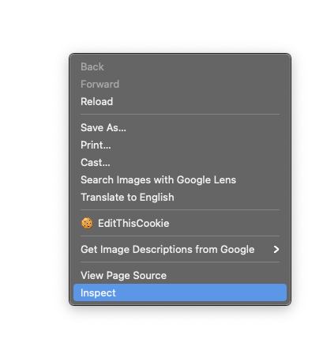
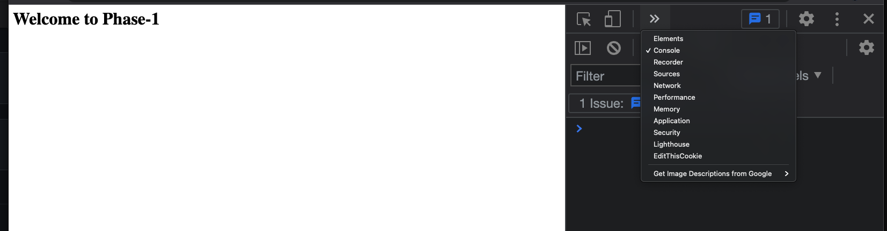

Phase-1 Activity 


Open the index.html file in your browser. 

right-click the browser and select `inspect`



A sidebar will pop up. Select the `console` tab. You may need to first select `>>` if you do not see `console`


Do the following in the index.js file.
Every time you complete a deliverable, save the file and refresh the browser.  

1. Crate a book variable with a let  and cat variable with a const. Assign these variables values. Note: You should not see anything in the browser console yet.
 <details>
      <summary>
        solution 
      </summary>
      <hr/>
      ```
        let book = 'JavaScript: The Definitive Guide';

        const cat = 'Rose';
      ```
   
 </details>


2. console.log those variables. When you refresh the browser you should see the value of your variables in the browser console. 
 <details>
      <summary>
        solution 
      </summary>
      <hr/>
      ```
        console.log(book);

        console.log(cat);
      ```
   
 </details>

 3. Create a conditional statement using an `if` block that will console.log the book variable. What scope is the book variable defined in? 

 <details>
      <summary>
        solution 
      </summary>
      <hr/>
      ```
        if(book == 'JavaScript: The Definitive Guide'){
            console.log(book)
        };
      ```
   
 </details>

4.  Using the same conditional statement you just wrote, change the value of book to a new value if true. 
console.log the book variable after you assign it a new value. 
 <details>
      <summary>
        solution 
      </summary>
      <hr/>
      ```
        if(book == 'JavaScript: The Definitive Guide'){
            book = 'Eloquent JavaScript'
            console.log(book)
        };
      ```
   
 </details>

 Bonus 

5. Add an `else` block to your conditional statement. In the else, assign book a different value and console.log the book. 

Test this out by manually changing the books original value so it executes the else block.


 <details>
      <summary>
        solution 
      </summary>
      <hr/>
      ```
        if(book == 'JavaScript: The Definitive Guide'){
            book = 'Eloquent JavaScript'
            console.log(book)
        } else {
           book = 'You don\'t know js'
           console.log(book) 
        };
      ```
   
 </details>

 6. Add `debugger` to your if block 
before and after defining book. Refresh the browser. What happened? 

Next select `console`. Type in book. You should get an error. Why are you seeing this error?

Next, hit the blue play button to continue the execution to the next debugger. Type in book in the console again. You should now be seeing the value of book instead of an error. Why?

 <details>
      <summary>
        solution 
      </summary>
      <hr/>
      ```
      debugger;
          let book = 'JavaScript: The Definitive Guide';
      debugger;
      ```
   
 </details>